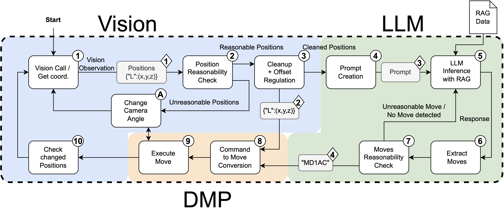

# TOH solver

This directory contains the LLM that solves the game in the green part of the above overview:
# USAGE:
### Execute
    python toh_llm.py
## INPUTS
It uses the states as inputs in this format that can also be seen in the example States_positions.json
  
    "states":
    {
    "A": [],
    "B": ["3","2","1"],
    "C": []
     }
## OUTPUTS
Outputs are in desired format and can be altered in the class function 

    class TowerOfHanoiState:
        def save_with_moves(self):

Outputs will be saved in 
    
    States_positions_solution.json

Output-format includes the final state and if wished the estimated positions of the cubes can be updated with mov.py, BUT SCRIPT NEEDS ADAPTATION TO NEW OUTPUT FORMAT THIS WILL ONLY BE IMPLEMENTED IF NEEDED!:

    "states": {
    "A": [],
    "B": [],
    "C": [
      "3",
      "2",
      "1"
    ]
     },
    "moves": [
    "BlueBC",
    "RedBA",
    "BlueCA",
    "GreenBC",
    "BlueAB",
    "RedAC",
    "BlueBC"
    ]
 