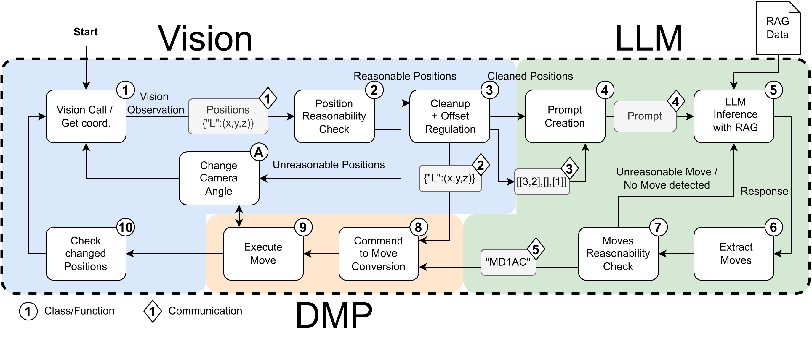

# RobotLearningFinal


### LLM
Tower of hanoi game solver with LLM(green part of the overview) and its scripts are located in the directory /LLM_TOH

## Task execution:
### 1. Simulation

To execute the task in simulation, follow the instructions provided in the `DMP_ToH/README.md`.

### 2. Real Robot Execution

To run the task on a real robot, follow these steps:

#### Step 1: Launch the Position Controller

```
roslaunch om_position_controller position_control.launch sim:=false use_rs:=true
```

### Step 2: Run the RealSense-Based Detection

```
cd src/Vision_ToH/
python3 rs_detect.py
```
This will detect the cube positions using a RealSense camera and publish their poses for pick-and-place execution.
### Step 3: Execution

Copy the files from `Code used on real robot` to your execution directory and execute them in the same way as in the simulation.


## Example Videos

We provided three example videos to showcase the functionality of our system.

[](Real_Base_720p.mp4)

The real execution of the base setup for tower of Hanoi is shown in `Real_Base_720p.mp4`, while another starting state is presented in `Real_Other_Starting.mp4`.
In `Simulation.mp4`, an example of the simulation is shown.
